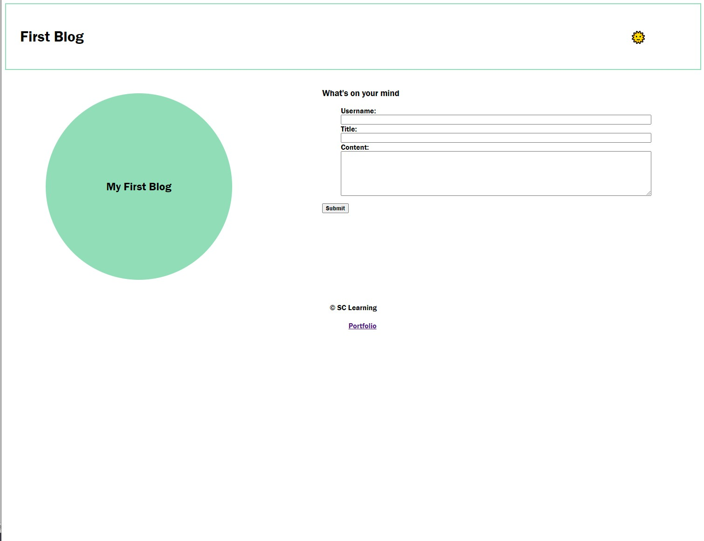
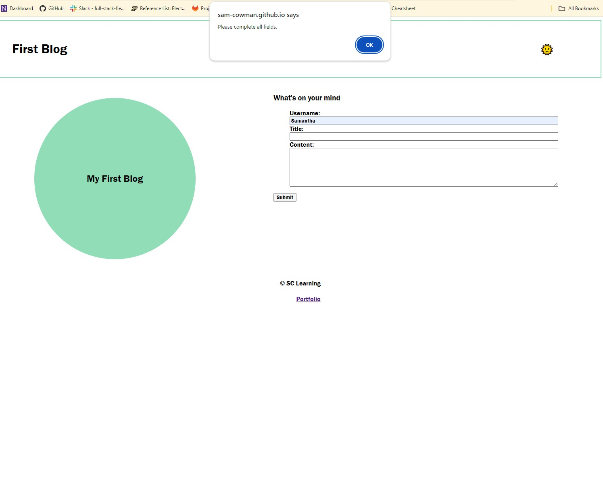
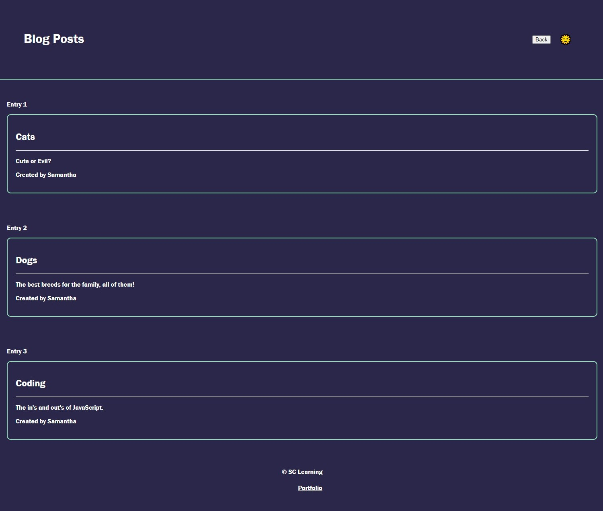

# First-Blog
Module 4 challenge

## Description
This blog page was created for users to create and view their own posts. Users will enter in their own posts on the landing page, once they hit submit they will see all their posts on the next page. The user can also utilize the sunshine emoji to display a light or dark mode for their page. For the developer, this website shows the stored blog posts in local storage. 

Code Highlights:

* Semantic tags
* CSS styling 
* CSS variables 
* Javascript 
* Conditional Statements 
* Arrays
* Javascript Iteration
* Functions 
* Objects
* Local Storage 
* KeyBoard Events 

Demo App [https://sam-cowman.github.io/First-Blog/] (https://sam-cowman.github.io/First-Blog/)

## Usage
The user can utilize the landing page to make new blog posts and then after submitting be redirected to the render blog posts page.  On the landing page, if the user does not complete all fields they will be prompted to do so before being able to submit.  Both pages can toggle between light and dark mode with the sunshine emoji.  On the blog posts page, the user can hit the back button to be redirected to the landing page. Please review screenshots below. 

## Credits
None 

## License
No License 